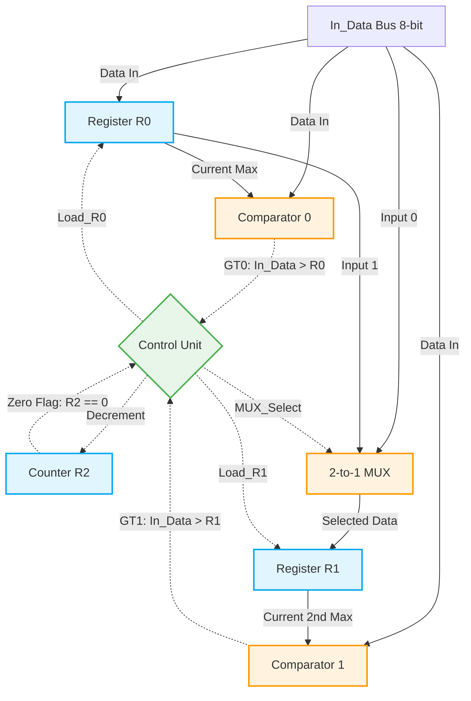

# نمودار پیدا کردن دو مقدار بیشینه

```mermaid
graph TD
    IN[In_Data Bus 8-bit]
    R0[Register R0]
    R1[Register R1]
    R2[Counter R2]
    MUX[2-to-1 MUX]
    COMP0[Comparator 0]
    COMP1[Comparator 1]
    CU{Control Unit}
    IN -->|Data In| R0
    IN -->|Data In| COMP0
    R0 -->|Current Max| COMP0
    IN -->|Data In| COMP1
    R1 -->|Current 2nd Max| COMP1
    IN -->|Input 0| MUX
    R0 -->|Input 1| MUX
    MUX -->|Selected Data| R1
    COMP0 -.->|GT0: In_Data > R0| CU
    COMP1 -.->|GT1: In_Data > R1| CU
    R2 -.->|Zero Flag: R2 == 0| CU
    CU -.->|Load_R0| R0
    CU -.->|Load_R1| R1
    CU -.->|MUX_Select| MUX
    CU -.->|Decrement| R2
    classDef reg fill:#e1f5fe,stroke:#03a9f4,stroke-width:2px;
    classDef logic fill:#fff3e0,stroke:#ff9800,stroke-width:2px;
    classDef ctrl fill:#e8f5e9,stroke:#4caf50,stroke-width:2px;
    class R0,R1,R2 reg;
    class MUX,COMP0,COMP1 logic;
    class CU ctrl;
```
